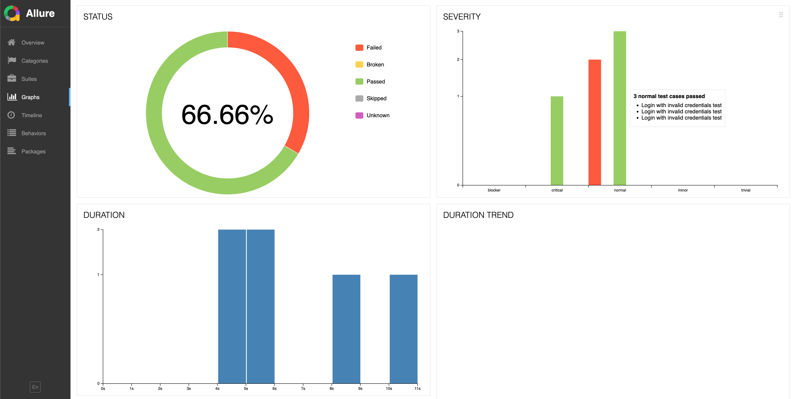

## System requirements
- Python 3.8 or higher.
- OS:
    - Windows 10+, Windows Server 2016+ or Windows Subsystem for Linux (WSL) or
    - macOS 13 Ventura + or
    - Debian 12, Ubuntu 22.04, Ubuntu 24.04, on x86-64 and arm64 architecture or

## Environment Setup
- Clone this repo and `cd` the folder
- Rename `.env_sample` file to `.env`
    - Set the values of environment variables accordingly
- (optional) Setup virtualenv
    - `python3 -m pip install virtualenv`
    - Set venv: `python3 -m venv venv`
    - Activate: 
        - linux/macos: `source venv/bin/activate`
        - windows: `.\venv\Scripts\activate`
    - Deactivate: `deactivate`
- (optional)[Install Allure Reports binary](https://allurereport.org/docs/install/#install-or-upgrade-allure-report): In order to generate rich HTML reports, install according to your OS

## Project Setup
- `python3 -m pip install -r requirements.txt`
- Set up the Playwright WebKit: `playwright install`

## Project Structure
```
.
├── pages: Page object modelling of project's pages or components
|    └── components: Folder to containing common components like header's or search bars
├── tests: Test functions
├── utils: Utilitary functions to be used on the project
├── .gitignore: Definitions of non tracked files
├── conftest.py: Pytest fixtures
├── requirements.txt: Lybraries utilized on the project
├── README.md: File with project's instructions
└── test_execution.log: Test execution logs file created when running the tests for the first time.
```

## Running tests
The basic command to run tests is:
```
python3 -m pytest tests/<test suite to run>
```
PS: `pytest-playwright` plugins uses headless mode by default
for more options, we can add more parameters as it follows:

### Running on HEADED mode:
`python3 -m pytest tests/<test suite to run> --headed`

### Adding Allure reports
add `--alluredir <folder containing report files> --clean-alluredir` to the test command

### Generating reports
on the terminal, after installing allure:
`allure serve <folder containing report files>`



